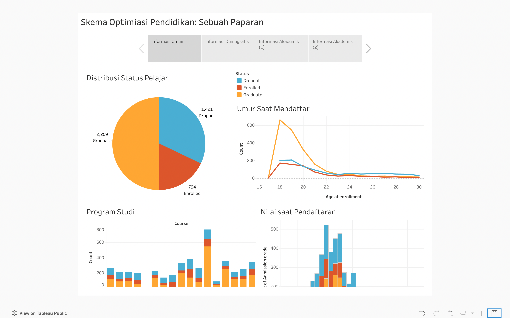

# Proyek Akhir: Menyelesaikan Permasalahan Perusahaan Edutech

- Nama: Louis Widi
- Email: louizzzwidi@gmail.com
- Id Dicoding: louis_widi

## Business Understanding
Jaya Jaya Institut merupakan salah satu institusi pendidikan perguruan yang telah berdiri sejak tahun 2000. Hingga saat ini ia telah mencetak banyak lulusan dengan reputasi yang sangat baik.

## Permasalahan Bisnis
1. **Jumlah dropout yang tinggi:** Jaya Jaya Institut ingin menjadi sebuah institusi pendidikan yang berkualitas dan dibuktikan dengan minimnya angka dropout.
2. **Metode deteksi dini:** Jaya Jaya Institut ingin memiliki sistem penanganan dropout, dibantu oleh sebuah metode deteksi dini yang baik, menggunakan pendekatan *machine learning*.
3. **Sarana pemaparan data:** Jaya Jaya Institut ingin memiliki sebuah dashboard yang dapat memberikan paparan terhadap data-data dinamika pendidikan yang terjadi, demi membantu pengambilan keputusan.

## Cakupan Proyek
1. **Identifikasi** faktor penyebab dropout dan membandingkannya dengan faktor-faktor yang mempengaruhi kelulusan. Hal ini akan membantu pihak institusi untuk memberikan program-program dan pendekatan pendidikan yang lebih baik.
2. **Pra-Premrosesan Data** yang akan digunakan dalam proses prediksi. Diharapkan, data-data yang digunakan merupakan data yang paling merepresentasikan informasi. Langkah-langkah pra-pemrosesan akan mencakup standardisasi dan encoding fitur kategorik, serta memilih fitur yang representatif.
3. **Modeling** untuk memberikan sebuah sarana yang dapat memprediksi apakah seseorang akan dropout, lulus, atau sedang belajar berdasarkan beberapa input fitur.
4. **Evaluasi Modeling** untuk mengetahui pendekatan model *machine learning* yang terbaik.
5. **Deployment** model *machine learning* untuk memberikan sarana interaktif bagi Jaya Jaya Institut dalam memprediksi *outcome* seorang pelajar.
6. **Dashboard** untuk memberikan paparan interaktif bagi Jaya Jaya Maju dalam memahami data terkait pendidikan.


### Persiapan

Sumber data: <a href = 'https://github.com/dicodingacademy/dicoding_dataset/blob/main/students_performance/README.md'>link data</a>

Setup environment:
```
conda create --name main-ds python=3.9
conda activate main-ds
pip install -r Requirements.txt
jupyter notebook
streamlit run app.py
```

## Business Dashboard
Business dashboard yang dibuat merupakan business dashboard yang diimplementasikan pada Tableau Public. Faktor yang ditampilkan bagi Jaya Jaya Institut untuk dapat memonitor performa pendidikan adalah faktor demografi dan latar belakang akademik. Dashboard dapat diakses melalui: 
<a href = 'https://public.tableau.com/app/profile/louis.widi.anandaputra/viz/SkemaOptimiasiPendidikanSebuahAnalisis/Story1'>
link

<a/>

## Menjalankan Sistem Machine Learning
Sistem *machine learning* yang dibuat adalah *prototype* yang teradapat pada Streamlit. 

```
streamlit run App.py
```
*Prototype* dapat diakses pada <a href = 'https://edu-techdata-science-louis-widi.streamlit.app/'>link (https://edu-techdata-science-louis-widi.streamlit.app/)</a>
## Conclusions

1. Demografis. Para pelajar yang mendaftar pada umur yang lebih tua cenderung memiliki berbagai tanggungan, maka mereka akan mengambil kelas malam. Beban pelajaran dan pekerjaan yang mungkin mereka miliki menghambat proses pembelajaran mereka. Hal ini ditambah dengan program studi yang mereka ambil kemungkinan merupakan program yang mereka jadikan formalitas dalam memiliki gelar, sehingga kurang .
2. Finansial. Para pelajar yang memiliki hutang, tidak tepat waktu membayar biaya pendidikan, dan tidak memiliki beasiswa akan lebih mungkin dropout. Hal ini dapat menjadi perhatian Jaya Jaya Institut untuk membantu para pelajar yang memiliki kesultan dalam sisi finansial, sehingga pelajar dapat fokus terhadap pendidikan.
3. Akademik. Dikarenakan beberapa faktor yang disebutkan sebelumnya, dukungan dalam sisi akademik sangat diperlukan. Hal ini karena hasil pendidikan selama 2 semester menunjukkan bahwa pelajar yang *dropout* memiliki nilai yang lebih rendah dibandingkan mereka yang *graduate*. Sehingga, dukungan akademik menjadi penting dalam meningkatkan keseluruhan kualitas pendidikan Jaya Jaya Institut

## Rekomendasi Action Items
- Memberikan bantuan konseling pada pelajar. Hal ini mengingat bahwa para pelajar yang memiliki umur lebih tua memiliki tanggung jawab yang lebih banyak dibandingkan para pelajar yang muda. Hal ini menjadikan para pelajar yang lebih tua butuh untuk diberi dukungan melalui konseling akademik yang dapat mendorong mereka untuk menyelesaikan pembelajaran mereka pada Jaya Jaya Institut
- Membuka lebih banyak kesempatan beasiswa. Melalui ketersediaan berbagai sarana untuk memenuhi kebutuhan finansial, para pelajar akan menjadi lebih termotivasi dan lebih fokus dalam menjalankan pendidikan mereka. Hal ini dapat berguna pula dengan memberikan kepada pelajar yang menerima beasiswa sebuah *sense of responsibility* ketika sudah diberikan bantuan finansial
- Menghadirkan sistem *learning buddy*. Sebuah sistem dimana para pelajar dapat memiliki *sense of belonging* dengan memiliki teman belajar dapat memotivasi mereka untuk menyelesaikan pendidikan. Hal ini dapat dilakukan Jaya Jaya Institut dengan memasangkan pelajar dengan kebutuhan lebih pada sisi akademik dengan mereka yang lebih memiliki kapabilitas. 
